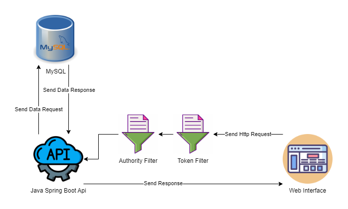
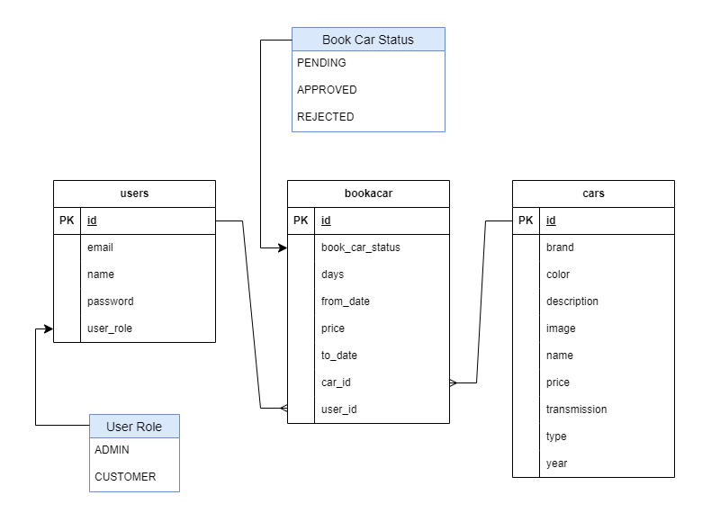

<div align="center">
<h1>Car Rental Backend</h1>


| [İnglizce](/README.md) | [Türkçe](/docs/README_TR.md) |


</div>

## Proje Genel Bakışı

Bu proje, araç kiralama sektöründe etkin bir rol oynamak için tasarlanmış modern bir web uygulamasını kapsamaktadır. Uygulama, yönetici (admin) ve müşteri (customer) rolleri arasında ayrım yaparak, her rol için özelleştirilmiş yetkilendirme ve işlevsellik sunar.

Uygulamanın ana özellikleri arasında araç kiralama listeleme ve arama işlevleri bulunmaktadır. Müşteriler, uygun araçları listeleyebilir ve kiralama süreçlerini yönetebilirken, yöneticiler ise araçları sisteme ekleyebilir, mevcut kiralama taleplerini yönetebilir ve genel araç bilgilerini düzenleyebilir.

Proje, Java tabanlı teknolojiler olan Spring Boot ve Hibernate kullanılarak geliştirilmiştir. Bu teknolojilerin sağladığı güçlü altyapı sayesinde, uygulama hızlı, güvenilir ve ölçeklenebilir bir şekilde çalışır. Ayrıca, Lombok kütüphanesi kod tekrarlarını azaltarak daha okunabilir bir yapı sunar.

Veritabanı işlemleri için ise JpaRepository kullanılmıştır. Bu sayede, araçların, kiralama taleplerinin ve müşteri bilgilerinin veritabanında verimli bir şekilde yönetilmesi mümkün olmuştur.


## Başlangıç

### Java 17'yi Yükle
- Bu uygulama Java 17 gerektirir.
- Java-17'yi indirip yüklemek için lütfen yandaki bağlantıya tıklayın: [Java-17](https://www.oracle.com/java/technologies/downloads/#java17)

### Gradle 8.7'yi Yükle
- Bu uygulama Gradle-8.7 gerektirir.
- Gradle-8.7'yi indirip yüklemek için lütfen yandaki bağlantıya tıklayın: [Gradle-8.7](https://gradle.org/releases/)

### Veritabanını Yükle ve Ayarla
- Bu uygulama MySQL 8 gerektirir.
- MySQL-8'i indirip yüklemek için lütfen yandaki bağlantıya tıklayın: [MySQL-8](https://dev.mysql.com/downloads/installer/)

### Uygulamayı Çalıştırma

- Repoyu klonlayın
   ```sh
   git clone https://github.com/harunsefainan/car-rental-backend
   ```
- Projeyi IntelliJ IDEA veya tercih ettiğiniz uygun bir IDE'de açın.
- Projeyi çalıştırın.
- Tarayıcıyı açın ve localhost:8080 adresine gidin (Portu değiştirdiyseniz 8080 yerine değiştirilmiş portu kullanın)

## Project Detayları



### Veritabanı

- Varlık Modelleri



## Kullanılan Teknolojiler

 <p align="center">
      
      
      
      
      
   </p>

  <hr>
<div align="center">
   <a href="mailto: harunsefa.inan@gmail.com" target="blank"></a>
   <a href="https://www.linkedin.com/in/harun-sefa-inan-761a2324b/" target="blank"></a>
</div>
<hr> 


<p align="right">(<a href="#top">back to top</a>)</p>
